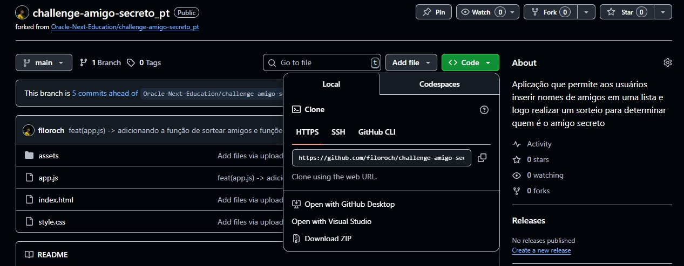

<div align="center">
  <h1 style="border-bottom: 1px solid white"><strong>Desafio</strong>: Amigo Secreto <br>Oracle Next Education </h1> 
  
  
</div>
O desafio consistia em desenvolver a logica de funcionamento da tela estatica do jogo Amigo Secreto, escrito em HTML e CSS. As tarefas eram bem definidas e restritivas


## Como rodar o projeto
Para rodar o projeto localmente, primeiro é necessario obter o projeto.

### Obtendo o projeto via zip
Clique em Code > Download ZIP:

### Obtendo o projeto via git:
```
git clone https://github.com/filoroch/challenge-amigo-secreto_pt
```
Necessario instalar o git bash no windows ou git no Mac/Linux

